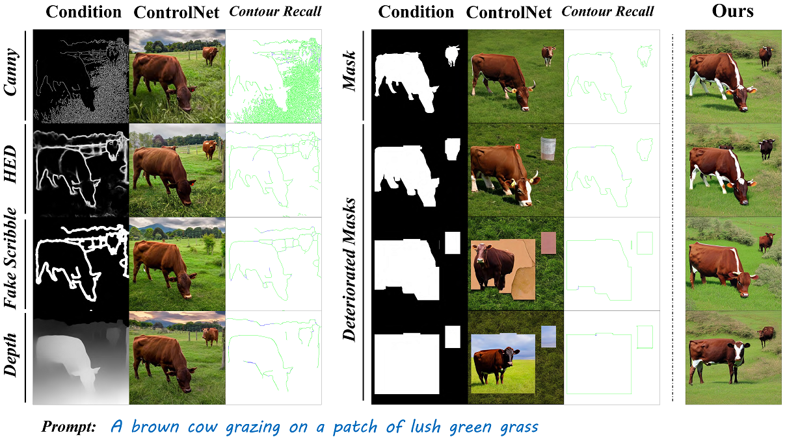
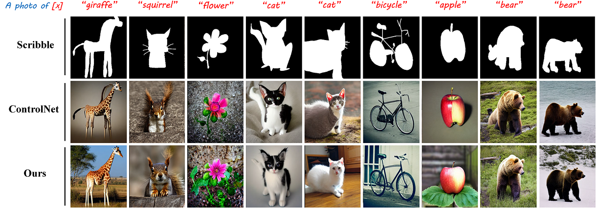

<h1 align="center">
     When ControlNet Meets Inexplicit Masks: <br/> A Case Study of ControlNet on its Contour-following Ability
</h1></h1> 
<p align="center">
<a href="https://arxiv.org/abs/2403.00467"></a>
</p>

> Wenjie Xuan, Yufei Xu, Shanshan Zhao, Chaoyue Wang, Juhua Liu, Bo Du, Dacheng Tao

This is the official implementation for Shape-aware ControlNet, which studies the contour-following ability of the influential [ControlNet](https://github.com/lllyasviel/ControlNet) by Zhang and improves its ability on dealing inexplicit masks, *i.e.*, deteriorated masks and human scribbles. Refer to our paper for more details.


## :fire: News

- **[2024/03/12]**: Codes for training and inference are released. 


## :round_pushpin: Todo

- [x] Release training and inference codes. Instructions on dataset preparation and checkpoints are also provided. 


## :sparkles: Highlight



- **Study on the contour-following ability of ControlNet.** We study the contour following ability of ControlNet quantitatively by examining its performance on masks of varying precision and hyper-parameter settings. We reveal inexplicit masks would severely degrade image fidelity for strong priors induced by inaccurate contours.
- **A improved shape-aware ControlNet to deal with inexplicit masks.** We propose a novel deterioration estimator and a shape-prior modulation block to integrate shape priors into ControlNet, namely Shape-aware ControlNet, which realizes robust interpretation of inexplicit masks. 
- **Extended usage for ControlNet with more flexible conditions like scribbles.** We showcase the application scenarios of our shape-aware ControlNet in modifying object shapes and creative composable generation with masks of varying precision. 


## :memo: Introduction

- Performance degradation of the vanilla ControlNet on deteriorated masks. 

  

- A shape-aware ControlNet is proposed to deal with inexplicit masks. 

  | Model Architecture                                           | Performance on Deteriorated Masks                            |
  | ------------------------------------------------------------ | ------------------------------------------------------------ |
  |  |  |

- Applications with more flexible conditional masks including programmatic sketches, human scribbles. It also support composable shape-controllable generation. 

  | Applications          | Examples                                                     |
  | --------------------- | ------------------------------------------------------------ |
  | Sketches & Scribbles  |  |
  | Composable Generation |  |


## :hammer_and_wrench: Install

**Recommended**: `Linux` `Python=3.11` `torch=2.1.2` `CUDA=12.2` `diffusers=0.25.1`

```shell
# set up repository 
git clone https://github.com/DREAMXFAR/Shape-aware-ControlNet.git
cd Shape-aware-ControlNet

# install conda environment 
conda env create -f environment.yaml 
conda activate shapeaware_controlnet
```


## :pushpin: Checkpoints

You can download the following model weights and put them in `controlnet_checkpoint/`.

| Model                  | Baidu Yun                                                    | Key    | Notations                                                    |
| ---------------------- | ------------------------------------------------------------ | ------ | ------------------------------------------------------------ |
| controlnet_lvis_mask   | [link](https://pan.baidu.com/s/14jtmwK6Thhvm0hEu502fGQ?pwd=2024) | `2024` | ControlNet trained on our LVIS_COCO datasets with segmentation masks. |
| controlnet_lvis_bbox   | [link](https://pan.baidu.com/s/1YgU8EWh0xpz-rzTcUeDFxQ?pwd=2024 ) | `2024` | ControlNet trained on our LVIS_COCO datasets with bounding-box masks. |
| shape-aware controlnet | [link](https://pan.baidu.com/s/1RKIw7UR7KMT_7ONM0jEbxQ?pwd=2024 ) | `2024` | Our proposed shape-aware controlnet, which is trained on LVIS_COCO with random dilated masks. |


## :rocket: Getting Started

> Here we suppose you are in `Shape-aware-ControlNet-master/`

#### Date Preparation

1. Download the COCO (for images) and LVIS (for instance segmentations and captions) dataset. 

   - `COCO`: https://cocodataset.org/#download
   - `LVIS`: https://www.lvisdataset.org/dataset

2. Pre-process the raw dataset and generate new `jsonl` file for our LVIS-COCO dataset. Run the following scripts. Note these `.py` files are just for reference. You can process the raw dataset on your own. 

   ```shell
   # generate jsonl for LVIS-COCO dataset
   cd custom_dataset/utils
   
   # configure the data path for COCO and LVIS, and the save path in prepare_lvis_coco.py.
   python prepare_lvis_coco.py
   
   # filter images with empty annotations and merge files 
   python filter_empty_anns.py  # filter empty annotations 
   sh merge.sh  # merge val_subtrain.jsonl and train.jsonl
   ```

3. Generate dilated masks and bounding-box images for training and test. 

   ```shell
   # # generate dilated masks 
   python vis_sketch_images.py
   ```

4. If you follows the provided scripts, the final dataset structure should be organized as follows. Note this setting is just for the usage of our data-loaders including `coco_offlinecond_dataset.py` and `lvis_coco.py` under `./custom_datasets/`. Remember to configure the global variables in `coco_offlinecond_dataset.py` and `lvis_coco.py`. 

   ```shell
   LVIS_COCO_triplet
     - train2017  # COCO train2017 images 
     - val2017  # COCO val2017 images 
     - conditional_train
       - epsilon_0_blackbg  # raw masks 
       - lvisbbox  # bounding-box masks 
       - dilate_5_within_bbox  # dilated masks with the radius=5
       - ...
     - conditional_val
       - epsilon_0_blackbg  # raw masks 
       - lvisbbox  # bounding-box masks 
       - dilate_5_within_bbox  # dilated masks with the radius=5
       - caption_val.jsonl  # filenames and captions (the 1st caption of each image by default)
       - ...
     - categories.jsonl  # category information 
     - train.jsonl  # train information 
     - val.jsonl  # val information


#### Training

1. Download the [SD_v1.5](https://huggingface.co/runwayml/stable-diffusion-v1-5) parameters from hugging-face and our shape-aware ControlNet checkpoints from [Baidu Yun](##:pushpin: Checkpoints). Put the SD parameters in anywhere you like and put our checkpoints under `./checkpoints`. Remember to modify the paths accordingly in `xxx`. 

2. Configure the hyper-parameters in `./train.sh` and run the scripts.  

   ```shell
   # train 
   sh train.sh
   ```

   > Notations for some arguments: 
   >
   > `--dataset_name`: in `['custom', 'livs']`, to use different dataloader. 
   >
   > `--conditioning_mode`: the directory name for the conditional images like segmentation maps. 
   >
   > `--dilate_radius`: set the `dilate_radius` for the masks, `random` for random dilation. 
   >
   > `--proportion_empty_prompts`: random dropping of the prompts for CFG. 
   >
   > `--do_ratio_condition`: enable the training of the modulated blocks. 
   >
   > `--do_predict`: enable the training for the deteriorate-ratio predictor. 
   >
   > `--detach_feature`: detach the gradient for deteriorate-ratio predictor. 
   >
   > `--predictor_lr`: set a separate learning rate for the deteriorate-ratio predictor. 

#### Inference

1. To inference with single image, configure the `./test_single` and run the following scripts. Remember to configure the global variables in `test_controlnet.py`. 

   ```shell
   # inference with shape-aware controlnet on single conditional image 
   sh test_single.sh
   ```

   > Notations for some arguments: 
   >
   > `--img_path`: the test image path. 
   >
   > `--prompt`: the prompt for the conditional images. 
   >
   > `--controlnet_path`: the controlnet checkpoint path. 
   >
   > `--output_path`: the directory path for saving the outputs. 

2. To inference with multiple images, *i.e.*, a mask image and a bounding-box image, configure the `./test_multi.sh` and run the following scripts. Remember to configure the global variables in `test_multicontrolnet.py`. 

   ```shell
   # inference with shape-aware controlnet on multiple conditional images 
   # Note: this application only supports two conditional images for mask and bbox
   sh test_multi.sh
   ```

   > Notations for some arguments: 
   >
   > `--prompt`:  the prompt for the conditional images. 
   >
   > `--mask_img_path`:  the image path of conditional mask. 
   >
   > `--mask_controlnet_path`: the controlnet checkpoint path for the mask branch. 
   >
   > `--mask_deteriorate_ratio`: the deteriorate ratio provided by users. If this value is not provided, the model will predict it on its own. 
   >
   > `--bbox_img_path`:  the image path of conditional bounding-box mask. 
   >
   > `--bbox_controlnet_path`:  the controlnet checkpoint path for the bounding-box branch. 
   >
   > `--bbox_deteriorate_ratio`: the deteriorate ratio provided by users. If this value is not provided, the model will predict it on its own. 
   >
   > `--output_path`:  the directory path for saving the outputs. 


## :art: Applications

> Here we showcase several application scenarios of our shape-aware controlnet. More details please refer to our paper. 

1. Generation with TikZ sketches and human scribbles.

   > TikZ sketches


   >  Human scribbles



2. Shape-prior modification of the generated images. The values above denotes the $\Delta \rho$. 


3. Composable shape-controllable generatio


## :bulb: FAQs

- [x] None


## 💗 Acknowledgements

- Our implementation is greatly based on the [diffusers](https://github.com/huggingface/diffusers), [Cocktail](https://github.com/mhh0318/Cocktail), [UniControl](https://github.com/salesforce/UniControl). Thanks for their wonderful works and all contributors.


## :black_nib: Citation

If you find our findings helpful in your research, please consider giving this repository a :star: and citing:

```bibtex
@article{xuan2024controlnet,
  title={When ControlNet Meets Inexplicit Masks: A Case Study of ControlNet on its Contour-following Ability},
  author={Xuan, Wenjie and Xu, Yufei and Zhao, Shanshan and Wang, Chaoyue and Liu, Juhua and Du, Bo and Tao, Dacheng},
  journal={arXiv preprint arXiv:2403.00467},
  year={2024}
}
```